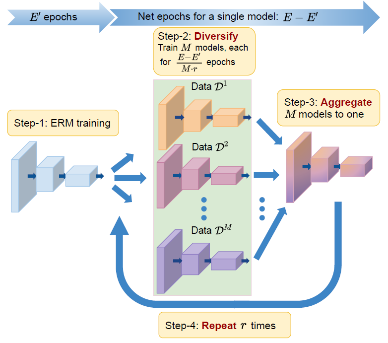
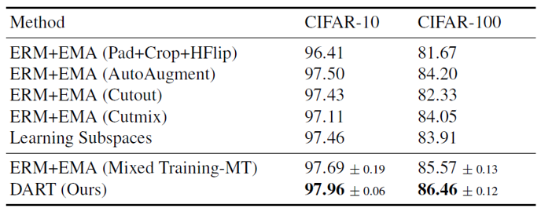
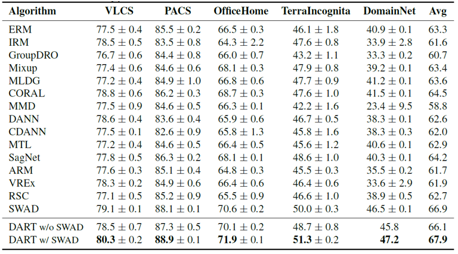
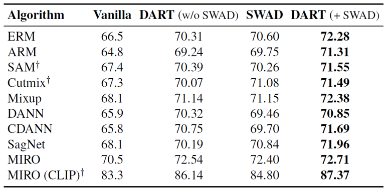

# DART: Diversify-Aggregate-Repeat Training
This repository contains codes for the training and evaluation of our CVPR-23 paper DART:Diversify-Aggregate-Repeat Training Improves Generalization of Neural Networks [main](https://openaccess.thecvf.com/content/CVPR2023/papers/Jain_DART_Diversify-Aggregate-Repeat_Training_Improves_Generalization_of_Neural_Networks_CVPR_2023_paper.pdf) and [supplementary](https://openaccess.thecvf.com/content/CVPR2023/supplemental/Jain_DART_Diversify-Aggregate-Repeat_Training_CVPR_2023_supplemental.pdf). The arxiv link for the paper is also [available](https://arxiv.org/pdf/2302.14685.pdf).
<p float="left">
  
   
</p>


 # Environment Settings 
* Python 3.6.9
* PyTorch 1.8
* Torchvision 0.8.0
* Numpy 1.19.2


# Training
For training DART on Domain Generalization task: 
```
python train_all.py [name_of_exp] --data_dir ./path/to/data --algorithm ERM --dataset PACS --inter_freq 1000 --steps 10001
```
### Combine with SWAD
set `swad: True` in config.yaml file or pass `--swad True` in the python command.
### Changing Model & Hyperparams
Similarly, to change the model (eg- VIT), swad hyperparameters or MIRO hyperparams, you can update ```config.yaml``` file or pass it as argument in the python command. 
```
python train_all.py [name_of_exp] --data_dir ./path/to/data \
    --lr 3e-5 \
    --inter_freq 600 \
    --steps 8001 \
    --dataset OfficeHome \
    --algorithm MIRO \
    --ld 0.1 \
    --weight_decay 1e-6 \
    --swad True \
    --model clip_vit-b16
```

# Results
## In-Domain Generalization of DART:
<p float="center">
  
 </p>
 
 ## Domain Generalization of DART:
 <p float="center">
   
   </p>
   
   ## Combining DART with other DG methods on Office-Home:
   <p float="center">
   
</p>


# Citing this work
```
@inproceedings{jain2023dart,
  title={DART: Diversify-Aggregate-Repeat Training Improves Generalization of Neural Networks},
  author={Jain, Samyak and Addepalli, Sravanti and Sahu, Pawan Kumar and Dey, Priyam and Babu, R Venkatesh},
  booktitle={Proceedings of the IEEE/CVF Conference on Computer Vision and Pattern Recognition},
  pages={16048--16059},
  year={2023}
}
```
